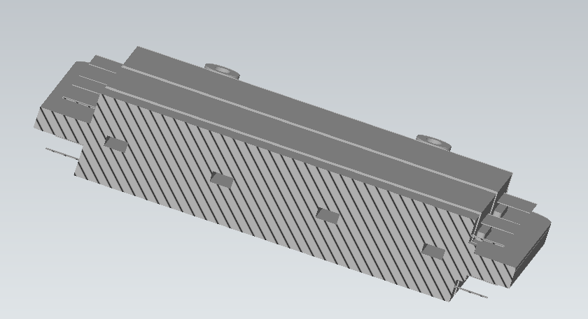
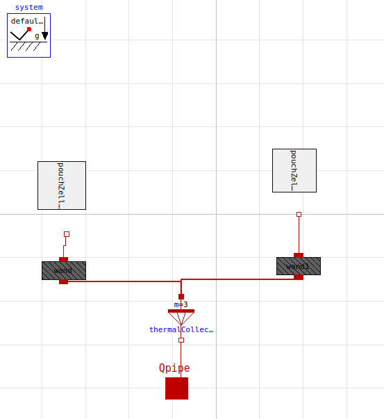
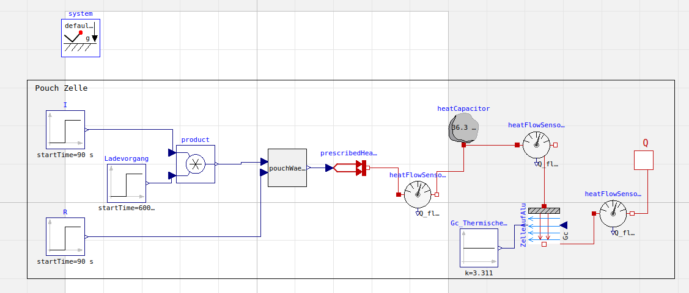
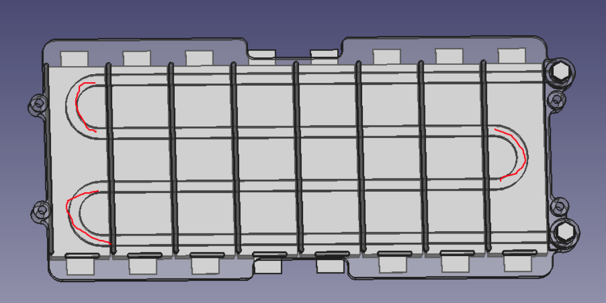

# Kiss Battery Model

## Description of battery

The battery pack consists of 9 racks, and 140 cells total. (Last rack: 
4 cells missing)

Each racks consists of 
- 2 aluminium plates (a 6 mm thick one with the cooling channel, light blue,
  and a 2 mm thin one the closes it, dark blue)
- 16 battery cells (8 om each side).

Further information:
- [CAD model](https://drive.google.com/file/d/1FuEZgo1fN1g1zlpC2dTb6hr2x3eCHonp/view?usp=sharing)
- [system description](https://docs.google.com/document/d/1ctgwckXKFOVCsTbGglB4ufbkGCjX_JtFagn6xUiasj0/)

## Description of model

The model is used to simulate the temperature time history of the battery cells.
The model represents one rack with 16 battery cells.

The model has several subcomponents, which are described below.

### PouchCellAndPipe

This element of the model represents two battery cells, and the cooling 
element between. In other words 1/8 of a rack.

The four pipe elements represent the four passes of the cooling channel over the battery cell.

Each CooledPouchCell in the block represents 2 quarter battery cells. 

The material between the pipes is modeled as well (as walls).

| Parameter | Value | Unit | description |
| --- | --- | --- | --- |
| tba |

### CooledPouchCell

This component describes the heat transfer of two attached battery cells (actually quarter battery cells) to the cooling channel.

| Parameter | Value | Unit | description |
| --- | --- | --- | --- |
| tba |

### PouchZelle

This is a model for 1/4 battery cell.

The left part models the electrical current and the resulting generated heat.
The right part describes the heat capacity of the battery cell and the thermal resistance 
of the contact between the battery cell and the adjacent cooling element (al plate).

| Parameter | Value | Unit | description |
| --- | --- | --- | --- |
| tba |

### Wand

An element for heat conduction. Used in two places:

1. heat conduction inside Al plate, between two adjacent channels
2. heat condiction through Al plate, from battery cell to fluid channel

Parameters:

| Parameter | Value | Unit | description |
| --- | --- | --- | --- |
| tba |

### PouchWaermemenge

This is a model for heat generation in 1/4 battery cell, $\dot Q = \frac{1}{4} R_i I^2$.

## How to run this model

- ...

## What should be improved/added

- model whole battery (9 racks)
- when all 9 racks are modelled, compare temperatures of cells over 
  racks. Find out if all racks are cooled similarly.
- model pressure loss (bends) inside a rack
- model pressure loss of inflow/outflow distribution pipes and bends.
- first and last bar in a rack are not correctly modelled: 
  pipe length and therefore heat transfer area are different
- understand model, compare to other designs, verify it's correctness
- investigate temperature distrubution inside a physical cell. If there 
  is s significant gradient, then we should model heat conduction inside 
  the cell.
- parameterise model so that we can use it in an optimisation loop.

  

## Results
Test Git-HUB Sentence Francesco

