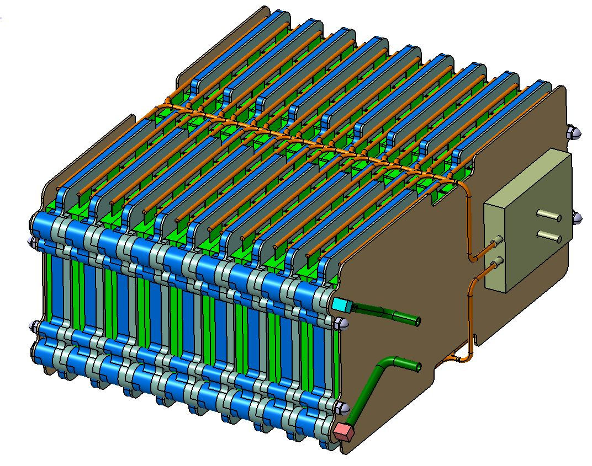
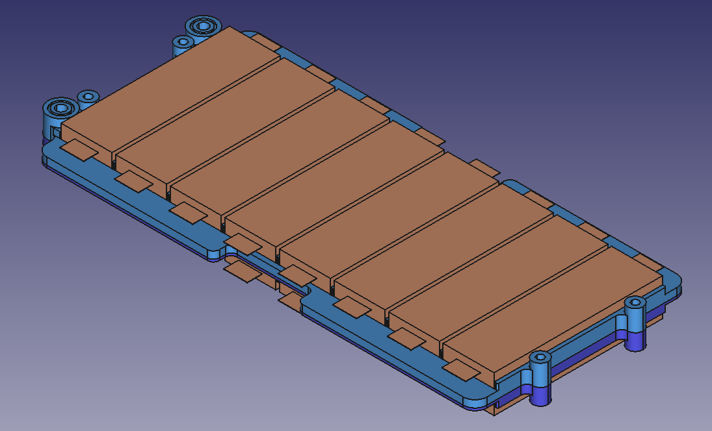
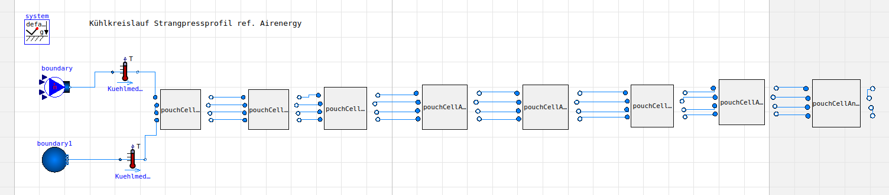
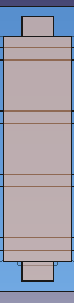
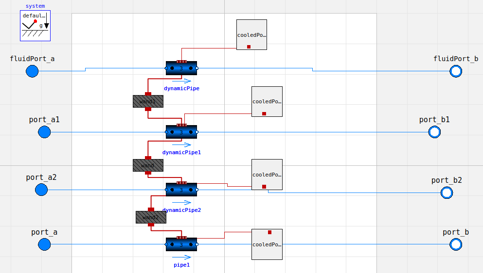

# Kiss Battery Model

## Description of battery

The battery pack consists of 9 racks, and 140 cells total. (Last rack: 
4 cells missing)

Each racks consists of 
- 2 aluminium plates (a 6 mm thick one with the cooling channel, light blue,
  and a 2 mm thin one the closes it, dark blue)
- 16 battery cells (8 om each side).

Further information:
- [CAD model](https://drive.google.com/file/d/1FuEZgo1fN1g1zlpC2dTb6hr2x3eCHonp/view?usp=sharing)
- [system description](https://docs.google.com/document/d/1ctgwckXKFOVCsTbGglB4ufbkGCjX_JtFagn6xUiasj0/)

## Description of model

The model is used to simulate the temperature time history of the battery cells.
The model represents one rack with 16 battery cells.

The model has several subcomponents, which are described below.

### PouchCellAndPipe

This element of the model represents two battery cells, and the cooling 
element between. In other words 1/8 of a rack.

The four pipe elements represent the four passes the cooling channel 

### CooledPouchCell

### PouchZelle

### Wand

An element hor heat conduction. Used in two places:

1. heat conduction inside Al plate, between two adjacent channels
2. heat condiction through Al plate, from battery cell to fluid channel

Parameters:

### PouchWaermemenge

- parts/classes
- assumptions made
- parameter

## How to run this model

- ...

## What should be improved/added

- ...